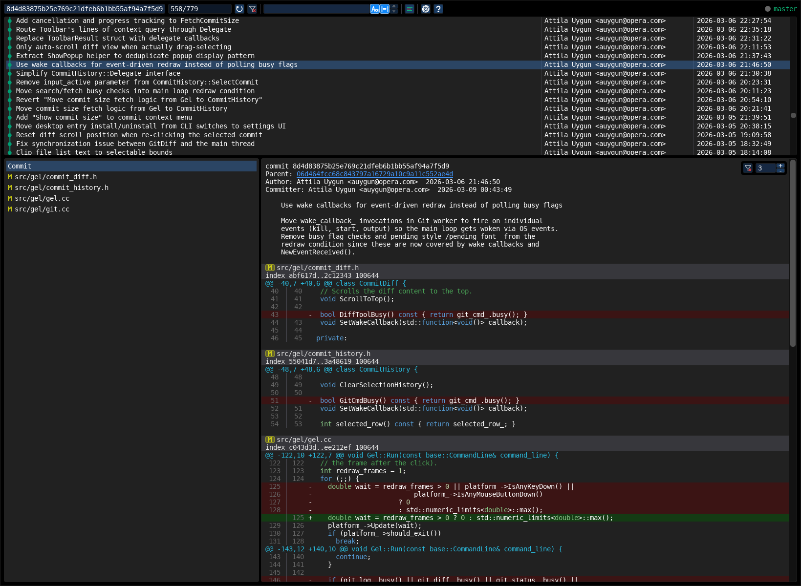
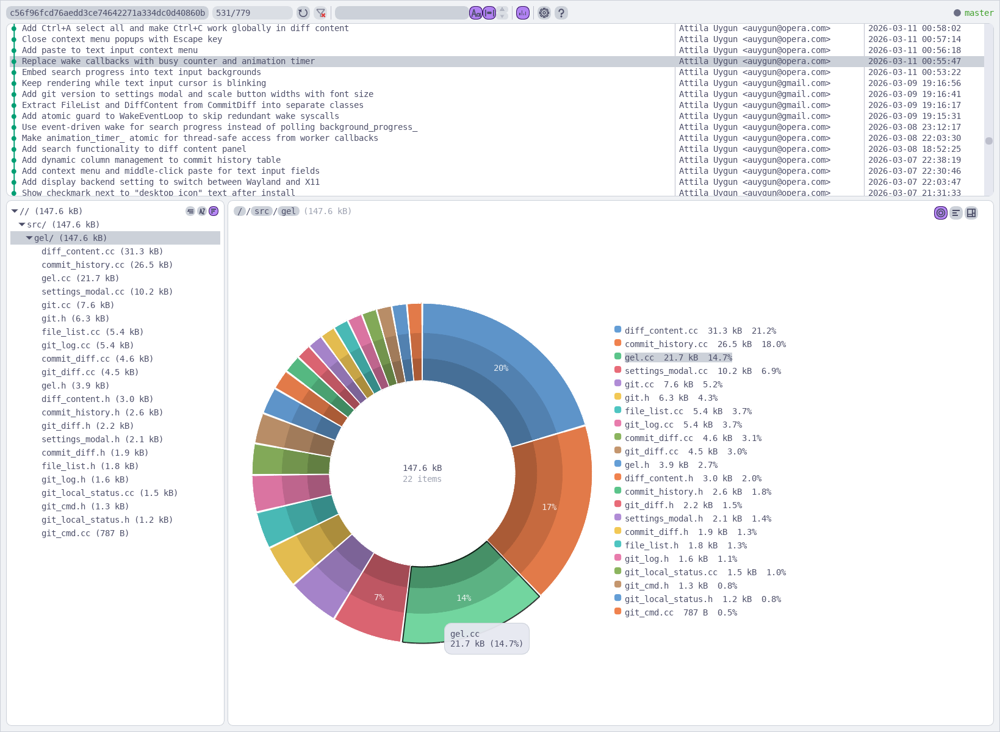
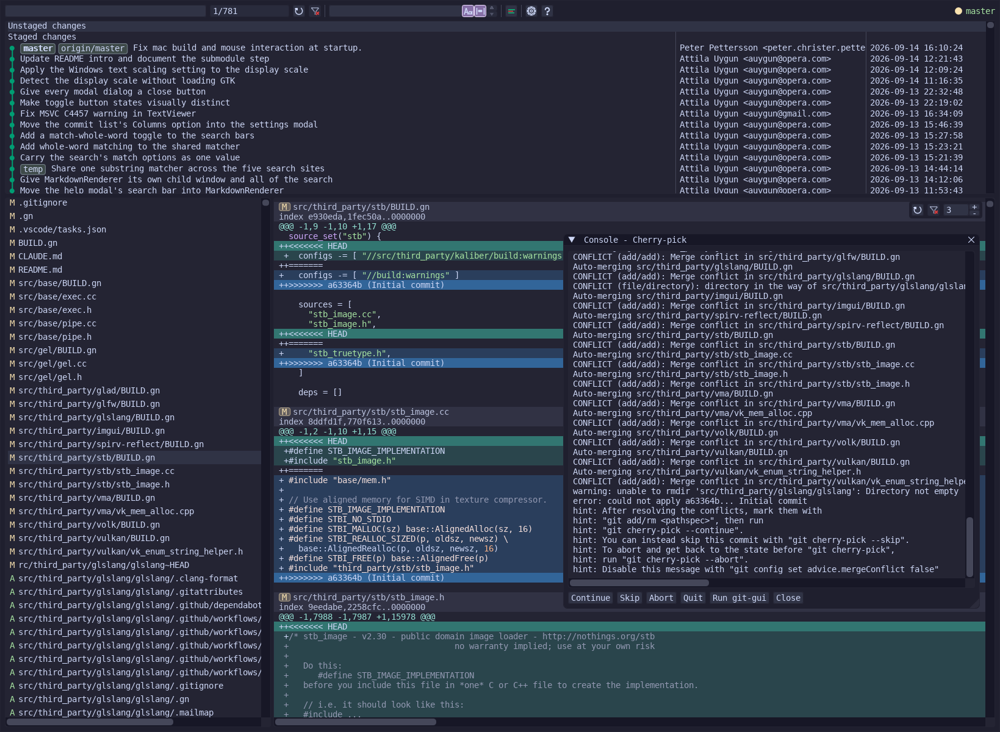

# Gel

Gel is a cross-platform, gitk-like graphical git repository browser.
It is useful for exploring and visualizing a repository's history and commit sizes, and supports
tools like cherry-picking, reverting, rebasing and merging. It uses Dear ImGui for its user
interface with Vulkan and OpenGL renderer backends.

**Supported Platforms:**
Linux (Wayland / X11),
macOS,
Windows

||||
|-|-|-|

See [HELP.md](HELP.md) for usage documentation.

## Installation:

Linux and macOS — install the latest release with the install script:
```text
curl -fsSL https://raw.githubusercontent.com/auygun/gel/main/install.sh | sh
```
The binary is installed to `~/.local/bin` or `/usr/local/bin`.
Set `GEL_VERSION` to install a specific version.

Windows — download `gel-windows-x64.exe` from the [releases page](https://github.com/auygun/gel/releases).

Note: on macOS, a binary downloaded from a browser is quarantined by Gatekeeper.

## Building from the command-line:

GN build system is required for all platforms:  
https://gn.googlesource.com/gn/

Clone and update the submodules:
```text
git submodule update --init --recursive
```
Generate build files for Ninja in release and debug modes:
```text
gn gen out/release
gn gen --args='is_debug=true' out/debug
```
Build:
```text
ninja -C out/release
ninja -C out/debug
```
Run:
```text
./out/release/gel
```

## Third-party libraries:

[ImGui](https://github.com/ocornut/imgui),
[GLFW](https://github.com/glfw/glfw),
[FreeType](https://github.com/freetype/freetype),
[Kaliber](https://github.com/auygun/kaliber),
[GLAD](https://github.com/Dav1dde/glad),
[Vulkan-Headers](https://github.com/KhronosGroup/Vulkan-Headers),
[glslang](https://github.com/KhronosGroup/glslang),
[SPIRV-Reflect](https://github.com/KhronosGroup/SPIRV-Reflect),
[VMA](https://github.com/GPUOpen-LibrariesAndSDKs/VulkanMemoryAllocator),
[Volk](https://github.com/zeux/volk),
[json](https://github.com/nlohmann/json),
[STB](https://github.com/nothings/stb),
[wayland-protocols](https://gitlab.freedesktop.org/wayland/wayland-protocols)
